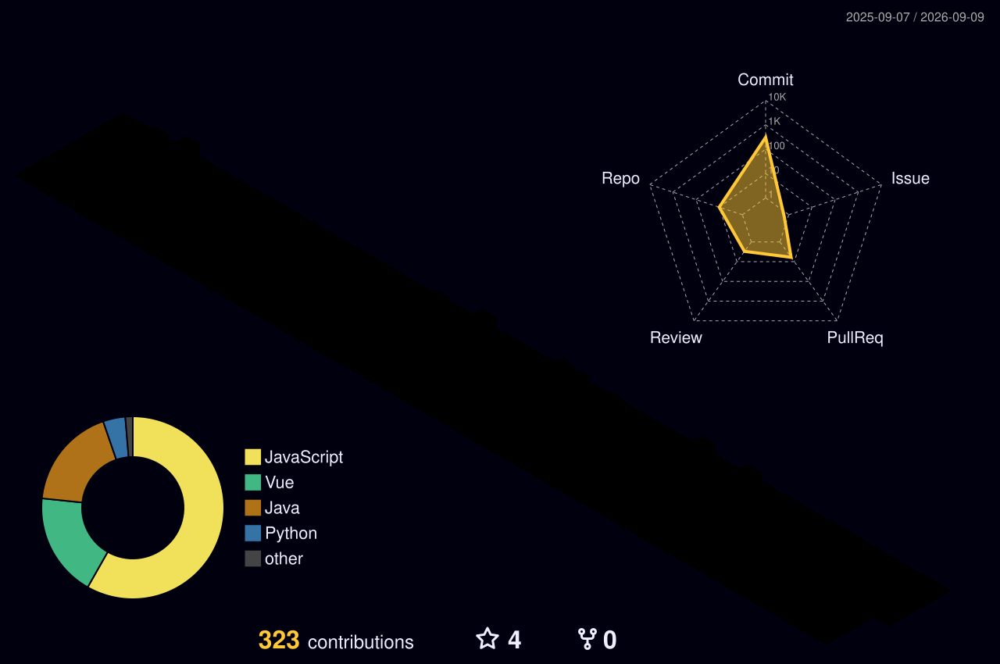

<h2 align="left">Olá 👋! Meu nome é Rosana Celine!</h2>

Desenvolvedora backend com mentalidade DevOps. Construo a aplicação e a levo até a produção.

###

<h2 align="left">✨ Sobre mim</h2>

- 🎓 Graduanda em Ciência da Computação no Instituto Federal do Ceará (IFCE), com formação técnica em Informática na mesma instituição.
- ☕ Foco em desenvolvimento backend com **Java 21, Spring Boot, APIs RESTful e PostgreSQL**.
- 🐳 Cuido do ciclo completo até a produção: Docker, servidores Linux, proxy reverso com Nginx e deploy em ambientes reais.
- 🧪 Experiência com testes automatizados (Python, Robot Framework) e CI/CD com GitHub Actions.
- 🧠 Concluí a bolsa PIBITI com uma solução inteligente para fenotipagem digital em saúde mental.
- 🏗️ Atualmente em um projeto de fiscalização predial e transparência cidadã.
- 🤝 Projetos voluntários e acadêmicos, como ONG Coração Valente, Her Tech Rise e Boamente.
- 🎯 Busco oportunidades em Backend ou DevOps/Infraestrutura.
###

<h2 align="left">👩‍💻 Linguagens e Tecnologias</h2>

  

###

<h2 align="left">⚙️ Infraestrutura e Ferramentas</h2>

  

###

<h2 align="left">🎉 Status</h2>

###

  
  

  
 |  |  |  
 | ----------- | ----------- |
