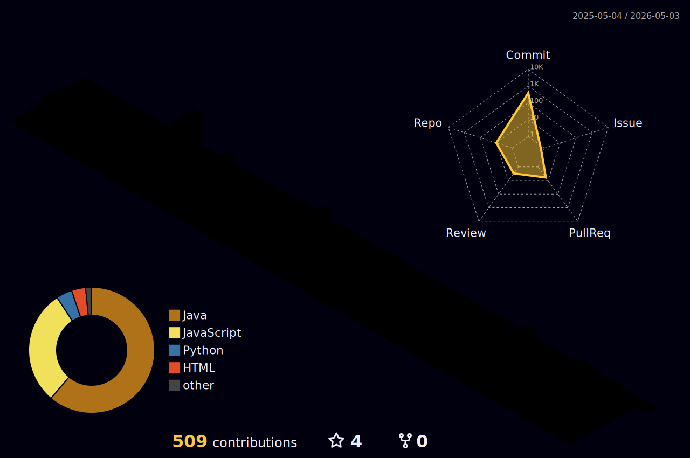

<h2 align="left">Olá 👋! Meu nome é Rosana Celine!</h2>

###

<h2 align="left">✨ Sobre mim</h2>

<ul>
  <li>⚡ Apaixonada por Tecnologia e Inovação.</li>
  <li>💻 Focada em Desenvolvimento Web Fullstack.</li>
  <li>📖 Estudante de Bacharelado em Ciência da Computação, no Instituto Federal do Ceará.</li>
  <li>📚 Cursando Técnico em Informática, no Instituto Federal do Ceará.</li>
  <li>🧠 Bolsista em Desenvolvimento de uma Solução Inteligente Baseada em Fenotipagem Digital para Saúde Mental.</li>
</ul>

###

<h2 align="left">👨‍💻 Linguagens</h2>

    
     

###

<h2>⚙️ Ferramentas</h2>

    
     

###

<h2 align="left">🎉 Status</h2>

###

  
  

  
 |  |  |  
 | ----------- | ----------- |
